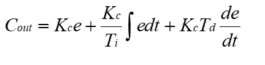

# PID Temperature Control of a Miniature Thermal Chamber

The PID Temperature Control of a miniature thermal chamber is a system designed for educational purposes. It can be used as an inexpensive lab for developing an understanding of process control and the effects of process dynamics on selecting the optimum PID (proportional, integral, and derivative) tuning constants. The system can be implemented inexpensively and would be ideal for a student doing an on-line course in process control systems. The system allows operating, PI, or PID control with reverse or forward (direct) acting control., by using selectable final control elements (resistive heater, or variable fan speed). The system provides 2 sets of process dynamics by tightly coupling a temperature sensor to the resistive heater or alternatively using a sensor in the centre of the chamber. These very different process dynamics require very different sets of PID tuning.

The system hardware consists of the miniature (100x68x50mm) thermal chamber, a control board and an interface board.

The control board consists of an Arduino Nano, a setpoint potentiometer for setting desire temperature in deg C and a disturbance potentiometer, selectable for either heater or fan. The outputs from the Nano are 2 pulse width modulated signals that produce a variable DC voltage that drives the fan and heater.

The interface board utilizes 2 N Channel power Mosfets and uses the PWM signals from the Nano to produce a PWM output with a maximum voltage of 12VDC to supply the thermal chamber heaters and fan.

The thermal chamber consists or 2 Cement resistor heaters of 5 watts each, a 12VDC fan, and 2 LM35DZ temperature sensors. One of the sensors measures the air temperature of the Chamber, while the other sensor is firmly attached to one of the temperature resistor heaters.

The following image shows the open chamber, with the 2 cement resistor heaters. The resistor on the right has the sensor affixed to the resistor.

The system hardware consists of the miniature (100x68x50mm) thermal chamber, a control board and an interface board.

The following image shows a block diagram for the system. Note that the Arduino Serial Plotter is used to display the Temperatures and Setpoints. It is also used to generate the following commands:

**TM35_1** sets the PID controlled variable as the temperature of one of the cement resistor heaters. In the phot, it is the cement resistor on the right.

**TM35_2** sets the PID Controlled variable as the temperature of the sensor in the middle of the chamber.

**Reverse** sets the PID controller to Reverse acting, where the temperature is controlled by the PID adjusting the voltage to the cement resistor heater. The fan then can be manually adjusted by the potentiometer to act as a disturbance.

**Forward** sets the PID controller to Forward(Direct) acting where the temperature is controlled by adjusting the fan voltage, and therefor air flow to the chamber. The heater then can be manually adjusted by the potentiometer to act as a disturbance.

**Manual** disables the PID controller and allows the the setpoint potentiometer to fix either the heater or fan setting from 0 to 100%. There is no feed back. This is referred to as open loop.

**Auto** enables the PID controller, either Reverse or Forward acting.

## Thermal Chamber Temperature Control System Features.
## Chamber
* Small volume chamber 100mmx68mmx50mm
* Heater Temperature sensor affixed to resistive heater
*	Air temperature sensor
*	2 resistive heaters (30 and 36 ohms), 12 VDC supply to heaters
*	Maximum heater temperature approx. 135 deg C
*	Maximum air temp about 60 deg C
*	2 distinctly different sets of process dynamics
  
## PID Controller
*	Standard (sometimes called Mixed) algorithm
*	Most commonly used in industry
*	Select Reverse or Forward (Direct) acting
*	Reverse uses heater as final control element
*	Forward uses fan as final control element
*	2 sets of PID tuning constants for 2 different process dynamic cases
*	Auto/Manual selection
  
## Display
* Runs independently with LCD display or along with Arduino Serial Plotter
* LCD
*	Heater temperature deg C
*	Air temperature deg C
*	Setpoint in deg C
*	Fan or Heater manual setting 0 to 100%
*	PID components displayed in real time
*	Proportional component
*	Integral component
*	Derivative component
*	Cout - total of three PID components

## Plotting
*	Uses Arduino IDE serial plotter
*	Plots Heater and air temperatures
*	Plots Setpoint or Manual setting
*	Generates the following commands
* Auto – sets PID controller to automatic
*	Manual – sets system to manual  open loop operation
*	Reverse – sets PID to reverse acting using heater as controller output
*	Forward – sets PID to forward acting using fan as controller output
*	LM35_1 – sets PID controlled variable to heater temperature sensor
*	LM35_2 – sets PID controlled variable to air temperature sensor
 
## Electronics
* Arduino Nano microcontroller*Connects to LCD Display via I2C bus
*	Generates 2 PWM outputs to Power Mosfet Interface board
* C Code generated from Arduino IDE
*	Setpoint and disturbance generated from 2 potentiometers connected to Nano analog inputs 
*	Temperature sensors – LM35 – generate 0 to 1.5 volts for 0 to 150 deg C
*	Power Mosfets IRF540N are switched  at 490 Hz and operate via Pulse Width Modulation to vary the voltage on the heaters

## How Does the PID Work?
Before the use of microcontrollers and computers PID controllers were implemented with analog electronic devices, the principle one being the operational amplifier.
Implementing PID control digitally uses an algorithm. There are several versions of the PID controller. The one implemented in this project is sometimes referred to as the Mixed or Standard implementation.
The mathematics of the mixed PID controller can be represented as the following.

Where:
Kc is the controller gain, Ti is the integral time, Td is the derivative time, and e is the error. Sometimes controller gain is represented as  Kc = 100%/PB where PB is referred to as Proportional Band. A smaller PB then results in a larger gain .
The following is pseudo code for implementing the PID algorithm. It is not in the form of an actual programming language but more in the form of a flow diagram.

The following is a simplified implementation for PID using C language:

## Open Loop Response for the Thermal Chamber.
When the PID Controller is put into **Manual** mode, that is the PID controller is disabled and a fixed value set by the potentiometer, an **open loop** response can be generated. This is very useful, because the open loop response yields valuable information about the dynamics of the process. 

For the Thermal Chamber suddenly changing the fixed heater setting to another fixed heater setting (called a **Step Change**), we can observe how, and how quickly the temperature changes. 

For the Air temperature, we would expect a much slower and smaller response than for the cement resistor temperature. 

These different responses characterize the **process dynamics** of the system. Getting the best response by our PID controller will require different **Proportional Band**, **Integral time** and **Derivative time** settings. Theses settings are known as the **tuning constants**. Using the open loop response, and a method called **Ziegler Nichols** we can generate a set of tuning constants by analyzing the plot of the open loop response.

The following plot is an open loop response for the temperature sensor attached to the cement resistor heater. Superimposed on the plot is the Ziegler Nichols calculations for determining the 'best" tuning constants.

The following chart is from an Excel spread sheet for using the information from the plot to calculate a set of PID and PI tuning constants:

Tuning Constant Spread Sheet.jpg

When these tuning constants are used they yield a response sometimes referred to as Quarter Decay. That is, the temperature will overshoot and undershoot several times with each successive overshoot being reduce to a quarter of the previous cycle. After several of these cycles, the temperature will reach the desired setpoint, referred to as steady state.

## Why is the PID Temperature Control of a Miniature Thermal Chamber So Useful as an Educational Platform?

Because of the flexibility of the system ( 2 sets of very different process dynamics, a reverse and forward acting controller, open loop and closed loop control) many labs can be set up to calculate tuning constants and then demonstrate  operation of a process control system using these tuning constants for the 2 processes and for Reverse and Forward acting controllers. This would enable a student to have a working knowledge of process control and make adapting to controlling industrial processes much more quickly and confidently.
